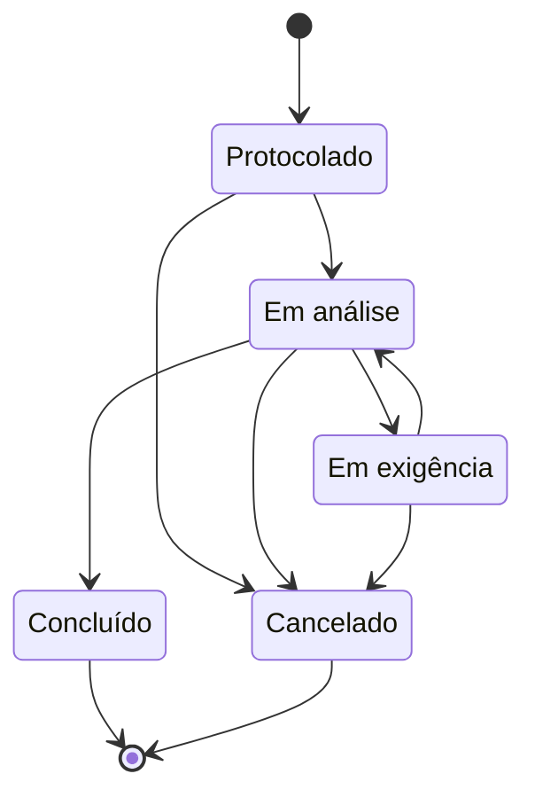

# Protocolo de Pedidos de Cartório

Sistema de protocolo de pedidos de serviço de cartório (segunda via de certidão, lavratura de escritura, reconhecimento de firma etc.), com numeração sequencial de protocolo por ano e controle do fluxo de estados de cada pedido.

Desafio técnico para a vaga de Desenvolvedor(a) Full Stack da **Codeform Tecnologia**.

**Stack:** NestJS 12 · Next.js 16 · PostgreSQL 16 · Prisma 6 · TypeScript · Jest · Docker (PostgreSQL)

---

## Sumário

- [Como rodar](#como-rodar)
- [Como testar](#como-testar)
- [Funcionalidades](#funcionalidades)
- [API](#api)
- [Decisões de arquitetura e trade-offs](#decisões-de-arquitetura-e-trade-offs)
- [Interpretações do enunciado](#interpretações-do-enunciado)
- [Estratégia de testes](#estratégia-de-testes)
- [O que eu faria com mais tempo](#o-que-eu-faria-com-mais-tempo)
- [Uso de IA](#uso-de-ia)

---

## Como rodar

### Pré-requisitos

- **Node.js 24.9 ou mais novo** (necessário para o Jest carregar os pacotes do NestJS 12, distribuídos em ESM)
- **Docker** (para o PostgreSQL)
- Git

### Passo a passo

```bash
# 1. Clonar
git clone https://github.com/rafaelrgaidzinski/codeform-protocolo.git
cd codeform-protocolo

# 2. Subir o banco
docker compose up -d

# 3. Backend
cd backend
cp .env.example .env
npm install
npx prisma generate        # gera o Prisma Client (versões recentes do npm não rodam mais esse passo sozinhas)
npx prisma migrate deploy  # cria as tabelas
npx prisma db seed         # tipos de pedido + 6 pedidos de exemplo
npm run start:dev          # API em http://localhost:3333

# 4. Frontend (em outro terminal, a partir da raiz do projeto)
cd frontend
npm install
npm run dev                # Aplicação em http://localhost:3000
```

Para voltar o banco ao estado inicial (apaga tudo, recria e roda o seed): `npx prisma migrate reset`, dentro de `backend`.

O arquivo [`backend/requests.http`](backend/requests.http) tem exemplos de todas as rotas, prontos para executar com a extensão **REST Client** do VS Code.

---

## Como testar

Dentro de `backend`:

```bash
npm test            # testes unitários (não precisam do banco)
npm run test:e2e    # testes de integração e de API (precisam do banco no ar)
```

São **69 testes**: 41 unitários e 28 de integração/API. Detalhes em [Estratégia de testes](#estratégia-de-testes).

---

## Funcionalidades

**Escopo obrigatório**

- Criação de pedido com tipo, solicitante, descrição e prioridade
- Listagem com filtro por status e por tipo, busca textual (protocolo, solicitante e descrição) e paginação
- Detalhe do pedido com o histórico completo de movimentações
- Máquina de estados validada no backend, com histórico de cada transição (origem, destino e data/hora)
- Numeração de protocolo `AAAA/NNNNNN`, única, sem buracos, reiniciando a cada ano, segura sob concorrência
- Seed com os tipos de pedido e pedidos de exemplo em todos os status

**Além do escopo obrigatório**

- Controle de concorrência também nas transições (duas pessoas movendo o mesmo pedido ao mesmo tempo)
- O backend informa as transições permitidas de cada pedido; o frontend só mostra os botões válidos
- Observação opcional em cada transição, registrada no histórico
- Health check (`GET /health`) que verifica a conexão com o banco

---

## API

| Método | Rota | Descrição | Sucesso |
|---|---|---|---|
| `POST` | `/pedidos` | Cria um pedido | 201 |
| `GET` | `/pedidos?status=&tipoId=&busca=&pagina=&porPagina=` | Lista com filtros e paginação | 200 |
| `GET` | `/pedidos/:id` | Detalhe com histórico e transições permitidas | 200 |
| `POST` | `/pedidos/:id/transicoes` | Move o pedido para outro status (`{ "para": "...", "observacao": "..." }`) | 200 |
| `GET` | `/tipos-pedido` | Tipos de pedido cadastrados | 200 |
| `GET` | `/health` | Saúde da aplicação e do banco | 200 / 503 |

**Códigos de erro**

| Código | Quando |
|---|---|
| 400 | Dados malformados: campo obrigatório ausente, valor fora da lista, id que não é UUID, campo não permitido (ex.: tentar enviar `status` na criação) |
| 404 | Pedido não encontrado |
| 409 | O pedido foi alterado por outra operação ao mesmo tempo |
| 422 | Violação de regra de negócio: transição não permitida ou tipo de pedido inexistente. A resposta da transição inclui o `statusAtual` e as `transicoesPermitidas` |

---

## Decisões de arquitetura e trade-offs

### Stack

Usei a stack da Codeform (NestJS, Next.js e PostgreSQL). Escolhi o **Prisma** como ORM pela produtividade (schema legível, migrations e seed simples), fixado na **versão 6** por estabilidade com o setup CommonJS do projeto. O SQL escrito à mão aparece em dois pontos: na numeração do protocolo, onde eu precisava de uma garantia que o ORM não oferece diretamente, e no `SELECT 1` do health check.

### Monolito modular, e não microsserviços

A Codeform trabalha com microsserviços, mas para este escopo optei por um **monolito modular** (`pedidos`, `tipos-pedido`, `prisma`). A numeração sem buracos depende de o pedido, o contador e o histórico serem gravados na **mesma transação**; separar em serviços exigiria coordenação distribuída sem ganho real neste tamanho. Os módulos já estão separados por assunto, o que facilitaria uma extração futura.

### Numeração de protocolo sem buracos

```sql
INSERT INTO contador_protocolo (ano, ultimo) VALUES ($ano, 1)
ON CONFLICT (ano) DO UPDATE SET ultimo = contador_protocolo.ultimo + 1
RETURNING ultimo
```

- Uma tabela `contador_protocolo` guarda o último número de cada ano. A sequência reinicia naturalmente, porque cada ano ganha a sua própria linha.
- O incremento acontece **na mesma transação** que cria o pedido e o histórico. O `UPDATE` trava a linha do ano até o fim da transação, então criações simultâneas **entram em fila**, e cada uma recebe o próximo número.
- Se algo falhar, a transação inteira é desfeita, **inclusive o incremento**. Nenhum número é perdido.
- `@@unique([ano, sequencial])` e `numero_protocolo UNIQUE` são uma rede de segurança no próprio banco.

**Alternativas descartadas:**

| Alternativa | Por que não |
|---|---|
| Sequence do PostgreSQL | Gera buracos quando uma transação falha e não reinicia por ano |
| `MAX(sequencial) + 1` | Duas transações podem ler o mesmo máximo ao mesmo tempo e calcular o mesmo número |

**Trade-off assumido:** as criações são serializadas por ano. No volume de um cartório isso é irrelevante; num sistema com milhares de criações por segundo, seria preciso outra estratégia.

**Ano do protocolo:** calculado no fuso `America/Sao_Paulo`. Um pedido criado às 23h30 de 31/12 (Brasília), que já é 01/01 em UTC, pertence ao ano que está terminando.

### Máquina de estados



- A regra fica num módulo **puro** (`src/pedidos/dominio/maquina-estados.ts`): uma tabela de transições permitidas, sem dependência de NestJS, banco ou HTTP. Isso a deixa legível e testável em milissegundos.
- A tabela é tipada como `Record<StatusPedido, StatusPedido[]>`: se alguém criar um status novo e esquecer de definir as transições dele, **o TypeScript não compila**.
- A máquina lança um erro de domínio (`TransicaoInvalidaError`); o service o traduz para HTTP 422. O domínio não conhece HTTP.
- O status atual vem **do banco**, nunca do cliente. O cliente informa apenas o destino.

### Duas técnicas de concorrência, cada uma no seu lugar

| | Numeração | Transição de status |
|---|---|---|
| Técnica | **Pessimista**: trava a linha do contador | **Otimista**: `UPDATE ... WHERE id = ? AND status = <status lido>` |
| Disputa | Constante (todo pedido usa o mesmo contador) | Rara (duas pessoas no mesmo pedido no mesmo instante) |
| Quando há disputa | Todos esperam e todos são atendidos | Um vence; o outro recebe 409, e a tela avisa o usuário e recarrega os dados |

Na transição, se o `UPDATE` não altera nenhuma linha, outra operação chegou antes: a API responde 409 e nada é gravado, nem o status nem o histórico.

### O frontend não conhece a regra de negócio

O backend devolve, junto com o pedido, a lista de `transicoesPermitidas`. O frontend desenha um botão para cada item dessa lista. A regra existe em **um único lugar**; o frontend só apresenta. Se alguém tentar uma transição proibida por outro caminho, o backend recusa.

### Não existe exclusão de pedido

Apagar um pedido abriria um buraco na numeração, e num cartório o protocolo é um registro oficial. O papel do "D" do CRUD é cumprido pelo **cancelamento**, que é um estado final.

### Outras decisões

- **Validação global** com `ValidationPipe` (`whitelist` + `forbidNonWhitelisted`): campos desconhecidos são recusados, e não ignorados em silêncio.
- **Configuração global compartilhada** (`configurar-app.ts`): o `main.ts` e os testes de API usam a mesma função, então os testes rodam com a configuração real.
- **Seed pelas regras de negócio:** os pedidos de exemplo são criados pelo próprio `PedidosService`, passando pela numeração e pela máquina de estados. O seed é idempotente: os tipos usam `upsert`, e os exemplos só são criados num banco sem pedidos.
- **Busca textual** com `ILIKE` (sem diferenciar maiúsculas e minúsculas) em protocolo, solicitante e descrição.
- **Paginação** com um envelope (`itens`, `total`, `pagina`, `porPagina`, `totalPaginas`) e limite de 100 itens por página.

### Ambiente de testes com NestJS 12

As versões recentes do NestJS são distribuídas em ESM, e o Jest não as carregava. Mantive o **ts-jest** para o código do projeto (preservando a checagem de tipos) e usei o **babel-jest** apenas para converter os pacotes `@nestjs/*` durante os testes. O `ValidationPipe` recebe o `class-validator` e o `class-transformer` explicitamente (`validatorPackage` / `transformerPackage`), porque o carregamento dinâmico do Nest falhava dentro do Jest; isso também deixa a dependência visível no código.

---

## Interpretações do enunciado

| Ponto em aberto | Interpretação |
|---|---|
| Transições além do exemplo | As do diagrama acima. Não há atalho de Protocolado para Concluído |
| De onde se pode cancelar | De qualquer estado não final: Protocolado, Em análise ou Em exigência |
| Estados finais | Concluído e Cancelado não têm saída |
| A criação entra no histórico? | Sim, como "(nenhum) → Protocolado", para o histórico contar a vida inteira do pedido |
| Pedido cancelado "abre buraco"? | Não: o número continua existindo, com status Cancelado |
| Qual ano define o protocolo | O da data de criação, no horário de Brasília |
| Solicitante | Nome obrigatório e CPF/CNPJ opcional (validado apenas pelo formato: 11 ou 14 dígitos) |
| Observação na transição | Opcional em todas as transições, registrada no histórico |
| Exclusão | Não existe; o cancelamento cumpre esse papel |

---

## Estratégia de testes

Não busquei um percentual de cobertura: concentrei os testes **onde está o risco**, em três níveis.

| Nível | Qtd. | O que cobre | Por quê |
|---|---|---|---|
| Unitários | 41 | Máquina de estados (**todas as 25 combinações** de origem × destino) e protocolo (formato, limites e virada de ano no fuso de Brasília) | A regra mais importante, testada por completo, em milissegundos |
| Integração (banco real) | 15 | **50 criações simultâneas** com números únicos e consecutivos; a numeração do ano inteiro sem buracos; transições simultâneas no mesmo pedido; transição proibida sem deixar rastro; listagem, filtros e paginação | Concorrência só se prova com o banco de verdade; um mock não teria trava |
| API via HTTP | 13 | Códigos HTTP, validação dos DTOs, formato das respostas, tentativa de burlar o fluxo enviando `status`, health check | O contrato que o frontend e outros clientes enxergam |

**O que não testei, e por quê:** o frontend não tem testes automatizados; priorizei o backend, onde estão as regras e a concorrência.

Os testes de integração rodam em série (`--runInBand`) porque compartilham o banco de desenvolvimento, e foram escritos para funcionar mesmo com dados preexistentes (usam marcadores únicos e números de protocolo, em vez de contagens absolutas).

---

## O que eu faria com mais tempo

**Itens opcionais do enunciado que ficaram de fora**

- **Kanban:** a listagem já recebe o status de cada pedido; o quadro agruparia por status, e os botões de ação continuariam vindo das `transicoesPermitidas`.
- **Cache com Redis:** não usei de propósito. No volume de um cartório, o PostgreSQL atende a listagem sem necessidade de cache, e cache mal invalidado é uma fonte clássica de bugs. Se fosse necessário, cachearia as estatísticas de um painel e a primeira página da listagem, invalidando as chaves a cada criação e transição.
- **Endpoint de IA:** um `POST /pedidos/sugerir-tipo` que envia o texto livre e a lista de tipos (código + descrição) para um LLM, pedindo resposta estruturada, com fallback por palavras-chave quando a IA estiver indisponível. A sugestão só preencheria o formulário; a escolha final seria do atendente.
- **Docker completo:** hoje o `docker-compose` sobe apenas o PostgreSQL. Faltam Dockerfiles para o backend e o frontend, com o `/health` como healthcheck do container.

**Qualidade e operação**

- Banco de dados isolado para os testes, zerado a cada execução
- Testes do frontend (React Testing Library) e CI com GitHub Actions rodando os testes a cada push
- Documentação da API com OpenAPI/Swagger

**Domínio**

- **Autenticação e auditoria:** registrar no histórico **quem** fez cada movimentação, essencial num cartório real
- Validação dos dígitos verificadores de CPF/CNPJ e cadastro de solicitantes em tabela própria
- Observação **obrigatória** ao registrar uma exigência (o cartório precisa informar o que falta)
- Fluxo de pré-cadastro com um estado *Rascunho*, em que o número de protocolo só é gerado na protocolação efetiva (rascunhos descartados não podem consumir número)
- Busca que ignora acentos (`unaccent`) e índice trigram (`pg_trgm`) para grandes volumes
- Filtros por prioridade e por período
- Tipos compartilhados entre backend e frontend num pacote comum

---

## Uso de IA

Usei o Claude (Anthropic) como par de programação durante todo o desafio: para discutir alternativas de arquitetura e seus trade-offs, gerar código, explicar cada arquivo e diagnosticar problemas de ambiente (como a compatibilidade do Jest com o NestJS 12 em ESM). As decisões foram tomadas por mim a partir dessas discussões, e cada etapa foi testada antes do commit.